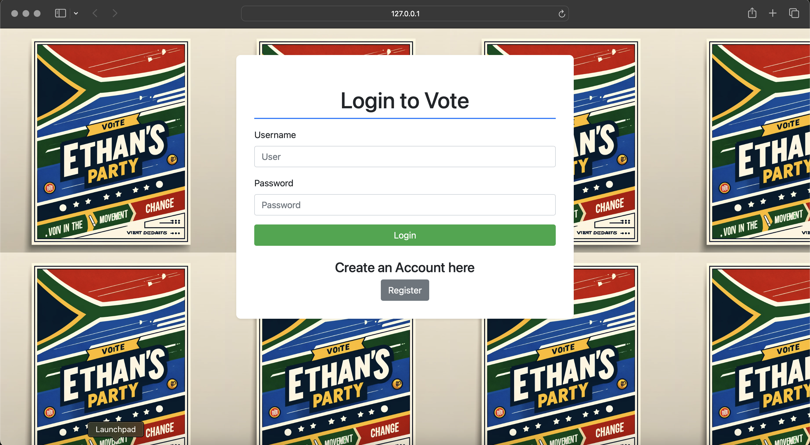
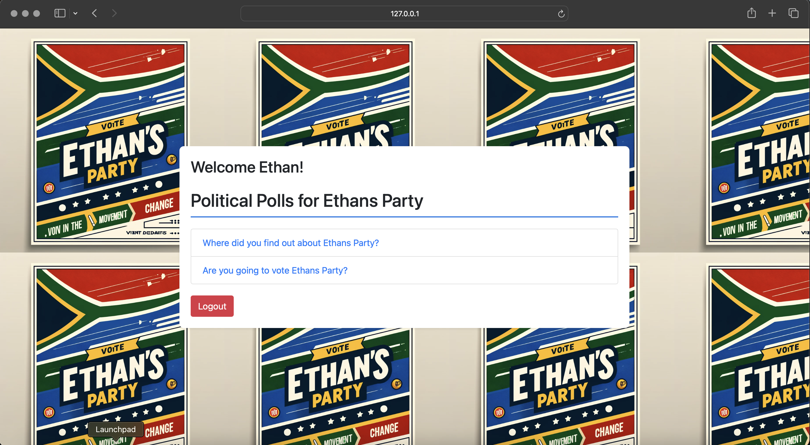

# Political Candidate ⚖️

## Overview
This project is a web application designed for a political candidate to manage and display polls. It allows authenticated users to view and participate in polls, see poll results, and manage their account. The application includes functionalities such as displaying available polls, voting on polls, and viewing poll results. The user interface is designed with HTML, CSS and bootstrap to provide a responsive and visually appealing experience.

## Setup and Installation

### Using Virtual Environment (venv)

1. **Create a virtual environment:**
   ```sh
   python3 -m venv venv

2. **Start virtual environment**

On Windows:
   ```sh
   .\venv\Scripts\activate
   ```

On Mac:
   ```sh
   source venv/bin/activate
   ```

## Installation
 1. Install required package:
 ```sh
pip install -r requirements.txt
```

 2. Run the application:
```sh
python manage.py runserver
```

## How to install Docker
   1. Go to https://www.docker.com/products/docker-desktop/ and install
      	Ensure that the “Use WSL 2 instead of Hyper-V” option is selected.
      
   3. Start Docker desktop
      After the installation completes, Docker Desktop should start automatically.
      
   5. Verify installation
      Open a command prompt and run the following command:
      ```sh
      docker --version
      ```

## Using Docker

  1. Build the Docker image:
   ```sh
   docker pull django-app
   ```
  2.  Run the Docker container:
   ```sh
   docker run -d -p 8000 django
   ```

Example Interaction:
- Login Page
  

- Home Page
  

## Credits

Lead Programmer

- Ethan Lewis [GitHub Profile](https://github.com/ethanlewis938/)

## Repository Link

[View the Repository](https://github.com/ethanlewis938/politicalCandidate/)
